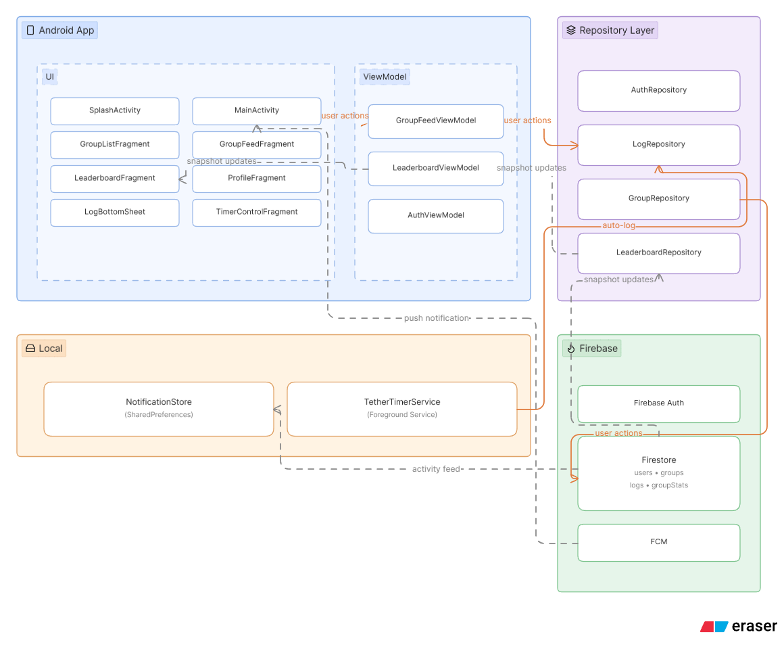

<div align="center">


# Tether

**No noise. Just you, your crew, and the grind.**

Tether is a native Android social accountability app built for people who work better with a little competition. Create a group with your friends, pick a goal, and show up every day. Log your hours, build your streak, and watch the leaderboard tell the truth about who's actually putting in the work.

[](https://github.com/Hemanthraj09/Tether/releases/latest/download/Tether.apk)
[](https://github.com/Hemanthraj09/Tether/releases/latest)
[](https://android.com)
[](https://kotlinlang.org)

</div>

---

## What is Tether?

Nudge friends who've gone quiet. Run focused sessions with the built-in timer. Watch your heatmap fill up, one logged day at a time.

Tether keeps accountability tight — groups are invite-only, capped at 6 members, and the leaderboard resets every day. No passengers. Everyone shows up or the numbers say it all.

---

## Features

### 📊 Real-time Leaderboard
Daily leaderboard that resets sharply at midnight. Sorted by today's hours — not total, not weekly. Show up every day or fall behind.

### 🔥 Streaks & Heatmap
Per-group streaks tracked independently across all your groups. Full GitHub-style heatmap on your profile showing the entire calendar year at a glance.

### ⏱️ Focus Timer
Two modes — **Stopwatch** for tracking real work time, **Pomodoro** for structured 25-minute focus blocks. Runs as a foreground service with a persistent notification, even when the app is in the background. Session time is auto-logged when you stop.

### 👥 Group System
Create a group, share the 6-character invite code with your circle. Max 6 members per group — tight circles only. Creators can delete, members can leave anytime.

### 👊 Nudge
Tap anyone's avatar on the leaderboard to send them a push notification nudge. One nudge per person per day — use it wisely.

### 📈 Pace Indicator
If you're behind yesterday's pace, a chip appears on the leaderboard card. Disappears the moment you catch up.

### 🔔 Activity Feed
Today's Activity notification feed shows all group logs in real time. Unread dot on the bell icon when you have new activity.

---

## Architecture



Tether follows **MVVM** with a Repository pattern across 4 layers:

- **UI Layer** — Single-Activity with Navigation Component. Fragments for each screen, BottomSheet for logging and timer control.
- **ViewModel Layer** — `GroupFeedViewModel`, `LeaderboardViewModel`, `AuthViewModel` managing state via `StateFlow`.
- **Repository Layer** — `LogRepository`, `LeaderboardRepository`, `GroupRepository`, `AuthRepository` handling all Firestore operations.
- **Local Layer** — `NotificationStore` (SharedPreferences) for the daily activity feed. `TetherTimerService` as a foreground service for the focus timer.
- **Firebase** — Firestore with real-time snapshot listeners across `users`, `groups`, `logs`, `groupStats`. FCM for nudge push notifications. Firebase Auth for email/password and Google Sign-In.

---

## Tech Stack

| Layer | Technology |
|---|---|
| Language | Kotlin |
| UI | XML + View Binding, Navigation Component |
| Architecture | MVVM, Single Activity |
| Async | Kotlin Coroutines + StateFlow |
| Backend | Firebase Firestore, Firebase Auth |
| Push Notifications | Firebase Cloud Messaging (FCM) |
| Local Storage | SharedPreferences |
| Timer | Android Foreground Service |
| Min SDK | 26 (Android 8.0) |

---

## Installation

### Download APK directly

> **[⬇ Download Latest APK](https://github.com/Hemanthraj09/Tether/releases/latest/download/Tether.apk)**

1. Download the APK from the link above
2. On your Android device, enable **Install from unknown sources** in Settings → Security
3. Open the downloaded APK and install
4. Launch Tether and sign up

### Build from source

```bash
git clone https://github.com/Hemanthraj09/Tether.git
cd Tether
```

1. Open the project in **Android Studio**
2. Add your `google-services.json` from your Firebase project to `app/`
3. Build → **Run 'app'**

> Note: `google-services.json` is gitignored. You'll need your own Firebase project with Firestore, Auth, and FCM configured.

---

## Firestore Schema

```
users/{uid}
  → name, email, groupIds[], totalHours, uid

groups/{gid}
  → name, goalType, members[], inviteCode, createdBy, isSolo, createdAt

logs/{lid}
  → userId, groupId, userName, date, value (hours), note, createdAt

groupStats/{gid}
  → daily/{date}/{uid}: hours
  → weekly/{weekKey}/{uid}: hours
  → streaks/{uid}: currentStreak, longestStreak, lastLogDate
```

---

## Screens

| Screen | Description |
|---|---|
| Splash | Logo animation on every cold launch |
| Onboarding | 6-slide walkthrough on first launch |
| Auth | Email/password + Google Sign-In |
| Group List | All your groups with per-group streak |
| Group Feed | Real-time member stats, session button, invite code |
| Leaderboard | Daily rankings with pace indicators and nudge |
| Profile | Heatmap, total hours, About + FAQ |
| Timer | Stopwatch + Pomodoro with foreground service |

---

## Known Constraints

- Android only (no iOS, no web)
- Max 6 members per group by design
- Photo proof deferred (requires Firebase Blaze plan for Storage)
- Google Sign-In requires SHA-1 registration in Firebase console

---

## Built By

**Hemanth Raj** — CS (Data Science) undergrad at BMS College of Engineering, Bengaluru.

[](https://github.com/Hemanthraj09)
[](https://linkedin.com/in/hemanth-raj)

---

<div align="center">

*Builder. Explorer. Perpetually curious.*

</div>
