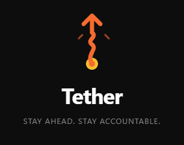
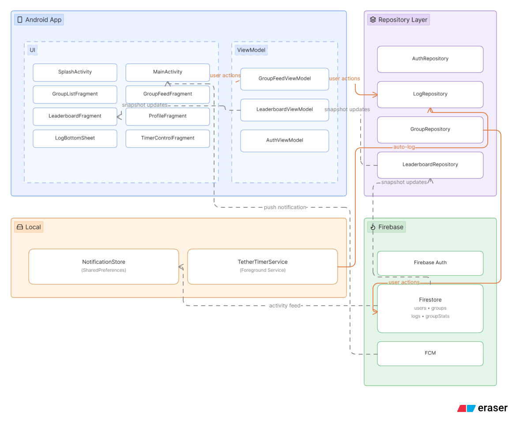

<div align="center">



## Tether

**No noise. Just you, your crew, and the grind.**

Tether is a native Android social accountability app built for people who work better with a little competition. Create a group with your friends, pick a goal, and show up every day. Log your hours, build your streak, and watch the leaderboard tell the truth about who's actually putting in the work.

[](https://github.com/Hemanthraj09/Tether/releases/latest/download/Tether.apk)
[](https://github.com/Hemanthraj09/Tether/releases/latest)
[](https://android.com)
[](https://kotlinlang.org)
[](https://github.com/Hemanthraj09/Tether/actions/workflows/ci.yml)

</div>

---

## What is Tether?

Nudge friends who've gone quiet. Run focused sessions with the built-in timer. Watch your heatmap fill up, one logged day at a time.

Tether keeps accountability tight — groups are invite-only, capped at 6 members, and the leaderboard resets every day. No passengers. Everyone shows up or the numbers say it all.

---

## Features

### 📊 Real-time Leaderboard
Daily leaderboard that resets sharply at midnight. It is sorted by today's hours, not by total or weekly hours, and Coding groups can rank by problems solved instead. Show up every day or fall behind.

### 🔥 Streaks & Heatmap
Per-group streaks tracked independently across all your groups. Full GitHub-style heatmap on your profile showing the entire calendar year at a glance. If LeetCode is connected, it can switch to solves per day.

### ⏱️ Focus Timer
Two modes — **Stopwatch** for tracking real work time (with 5/10-minute breaks), **Pomodoro** for 25/5 or 50/10 focus/break cycles. Runs as a foreground service with a live notification; time is computed from timestamps so it stays exact with the screen off, and a session survives the app being killed. Only focus time is logged.

### 👥 Group System
Create a group, share the 6-character invite code with your circle. Max 6 members per group — tight circles only. Creators can delete, members can leave anytime.

### 👊 Nudge
Tap anyone's avatar on the leaderboard or group screen to nudge them — they get a notification that opens the group. One nudge per person per day — use it wisely.

### 📈 Pace Indicator
If you're behind yesterday's pace, a chip appears on the leaderboard card. Disappears the moment you catch up.

### 🔗 Connected Accounts
Progress you don't have to log by hand. Connect your LeetCode username and problems you solve on **any device** sync automatically in the background (WorkManager, every few hours and on app open). Only public profile data is read. LeetCode is the first source; integrations are tied to a group's goal, so gym or study groups never see coding features.

### 🧩 LeetCode in the core loop
In a Coding group, LeetCode counts the same way logged hours do:
- **Streaks:** a verified solve today keeps your group streak alive, even if you didn't log any hours.
- **Ranking:** the group creator chooses whether the leaderboard ranks **hours logged** or **problems solved**.
- **Rows:** every member's row shows their solves today or this week, plus a trust note (✓ verified, ⚠ unconfirmed, or not connected).
- **Profile:** your heatmap can switch between hours and LeetCode solves.

Solves that LeetCode's own public data contradicts are not counted.

### 📷 Proof, not just hours
Every log says **what you did** ("Solved 3 graph problems"). A group's creator sets photo proof to **Off**, **Optional** or **Required**. In Required groups a manual log needs a fresh camera photo; focus-timer sessions are exempt because the timer measured the time.

Photos are shrunk on your phone (about 60 KB, location data stripped), visible only to your group, and gone after the day. Today's logs show on the group screen, where friends can back a log with **✓** or question it with **🤨**.

### 🎯 Said vs. Did
Pick what you want to stay accountable for (coding, studies, fitness, reading, work, habits) and set a weekly target for each. Your profile compares that with the hours you actually logged this week in matching groups: on track, behind pace (by how much), or "You said this matters. Nothing logged yet."

### 🔔 Activity Feed
Today's Activity feed on the home screen collects your groups' logs, joins and verified solves in real time. Unread dot on the bell icon when there's something new.

---

## Architecture



Tether follows **MVVM** with a Repository pattern across 4 layers:

- **UI Layer** — Single-Activity with Navigation Component (tab back stacks are saved and restored). Fragments collect state with `repeatOnLifecycle`; lists use `ListAdapter` + `DiffUtil`.
- **ViewModel Layer** — one ViewModel per screen exposing `StateFlow`s built from Firestore snapshot listeners (`stateIn(WhileSubscribed)`), so data survives navigation and renders from cache instantly.
- **Domain Layer** — pure, unit-tested Kotlin: `StreakCalculator`, `LeaderboardBuilder`, `TimerEngine`, `HeatmapGrid`, `InviteCodes`, `DateKeys`.
- **Repository Layer** — `LogRepository`, `LeaderboardRepository`, `GroupRepository`, `NudgeRepository`, … Multi-document writes use atomic batches/transactions.
- **Background** — `TetherTimerService` (foreground service, persisted state) and `RealtimeWatcher` (nudges + group activity while the app is alive).
- **Firebase** — Firestore (`users`, `groups`, `logs`, `groupStats/*`), Firebase Auth (email/password + Google), Crashlytics.

A detailed write-up of every feature, design decision and trade-off is in **[docs/IMPLEMENTATION.md](docs/IMPLEMENTATION.md)**.

---

## Tech Stack

| Layer | Technology |
|---|---|
| Language | Kotlin |
| UI | XML + View Binding, Navigation Component |
| Architecture | MVVM, Single Activity |
| Async | Kotlin Coroutines + StateFlow |
| Backend | Firebase Firestore, Firebase Auth |
| Notifications | Local notifications driven by Firestore listeners |
| Local Storage | SharedPreferences, Firestore offline cache |
| Timer | Android Foreground Service + pure `TimerEngine` |
| Crash reporting | Firebase Crashlytics (release builds) |
| Testing | JUnit (domain logic), Firestore emulator + `@firebase/rules-unit-testing` (security rules) |
| CI/CD | GitHub Actions — tests, lint, rules tests; signed APK on `v*` tags |
| Integrations | LeetCode public GraphQL API (on-device), WorkManager sync, Firebase Remote Config (query hot-fixes + kill switch) |
| Release | R8 minify + resource shrinking, baseline profiles via ProfileInstaller |
| Min SDK | 26 (Android 8.0) |

---

## Engineering

**Testing** — 87 unit tests cover the logic that decides what users see: streak rules (month/year/leap boundaries), leaderboard ranking and pace, the timer state machine (Pomodoro catch-up after sleep, breaks, reboot recovery), date keys, the heatmap grid, LeetCode response parsing (recorded fixtures), solve merging, sync backoff, solve counting and solve-based ranking, LeetCode ownership/claim verification, Said vs. Did pacing, proof-photo sizing and the Today list.

```bash
./gradlew testDebugUnitTest
```

**Security rules** — [`firestore.rules`](firestore.rules) keeps groups undiscoverable (invite codes can only be fetched one at a time), shows group data to members only, keeps emails off public profiles, requires every leaderboard increase to cite a matching log in the same atomic batch, caps totals at 24 h/day, validates streak transitions and checks dates against the server clock. A self-audit found 8 exploits; each is fixed and covered by one of the **97 emulator tests**. Proof photos and reactions are rule-checked too: a photo must arrive in the same batch as its brand-new log, uses the server's clock, and stops being served after 24 hours.

```bash
cd firestore-tests && npm install && npm test   # needs Java 11+ for the emulator
firebase deploy --only firestore:rules          # deploy after the tests pass
```

**Designed for an unofficial API** — LeetCode has no public API contract, so the integration assumes it can break: queries can be hot-fixed through Remote Config without an app release, sync backs off exponentially, parse failures degrade gracefully, and a daily GitHub Actions canary checks LeetCode's schema against the app's exact queries.

**CI** — every push runs unit tests, lint, a debug build and the rules tests. Pushing a tag like `v1.1.0` builds a signed release APK and attaches it to a GitHub Release as `Tether.apk`.

---

## Installation

### Download APK directly

> **[⬇ Download Latest APK](https://github.com/Hemanthraj09/Tether/releases/latest/download/Tether.apk)**

1. Download the APK from the link above
2. On your Android device, enable **Install from unknown sources** in Settings → Security
3. Open the downloaded APK and install
4. Launch Tether and sign up

### Build from source

```bash
git clone https://github.com/Hemanthraj09/Tether.git
cd Tether
```

1. Open the project in **Android Studio**
2. Add your `google-services.json` from your Firebase project to `app/`
3. Build → **Run 'app'**

> Note: `google-services.json` is gitignored. You'll need your own Firebase project with Firestore, Auth, and FCM configured.

---

## Firestore Schema

```
users/{uid}                        (public profile: no email, no group list)
  → uid, name, totalHours, leetcodeUsername, interests[], targets{area: hours}

groups/{gid}
  → name, goalType, members[], inviteCode, createdBy, isSolo, createdAt, metric ("hours" | "solves"),
    proof ("off" | "optional" | "required")

logs/{lid}
  → userId, groupId, userName, date, value (hours), note (what you did), createdAt, source, hasPhoto

groupStats/{gid}
  → daily/{date}/{uid}: hours
  → weekly/{weekKey}/{uid}: hours
  → streaks/{uid}: currentStreak, longestStreak, lastLogDate
  → nudges/{date}_{fromUid}_{toUid}: nudgerUid, nudgerName, nudgedUid, date, timestamp
  → proofs/{logId}: uid, date, createdAt, image (≤ 150 KB JPEG bytes, visible 24 h)
  → reactions/{logId}_{uid}: logId, uid, date, kind ("ok" | "doubt")

users/{uid}/completions/{key}
  → title, slug, source ("leetcode"), completedAt, syncedAt
users/{uid}/meta/completionIndex   → one-document index (members read 1 doc each)
users/{uid}/heatmap/{year}         → "yyyy-MM-dd": hours (owner only)

inviteCodes/{code}
  → groupId, createdBy   (fetched one code at a time, never listable)
```

---

## Screens

| Screen | Description |
|---|---|
| Splash | Logo animation on every cold launch |
| Onboarding | 6-slide walkthrough on first launch |
| Auth | Email/password + Google Sign-In |
| Group List | All your groups with per-group streak |
| Group Feed | Real-time member stats, session button, invite code |
| Leaderboard | Daily rankings with pace indicators and nudge |
| Profile | Heatmap, total hours, About + FAQ |
| Timer | Stopwatch + Pomodoro with foreground service |

---

## Known Constraints

- Android only (no iOS, no web)
- Max 6 members per group by design
- Photo proof deferred (requires Firebase Blaze plan for Storage)
- Google Sign-In requires SHA-1 registration in Firebase console

---

## Built By

**Hemanth Raj** — CS (Data Science) undergrad at BMS College of Engineering, Bengaluru.

[](https://github.com/Hemanthraj09)
[](https://linkedin.com/in/hemanth-raj)

---

<div align="center">

*Builder. Explorer. Perpetually curious.*

</div>
