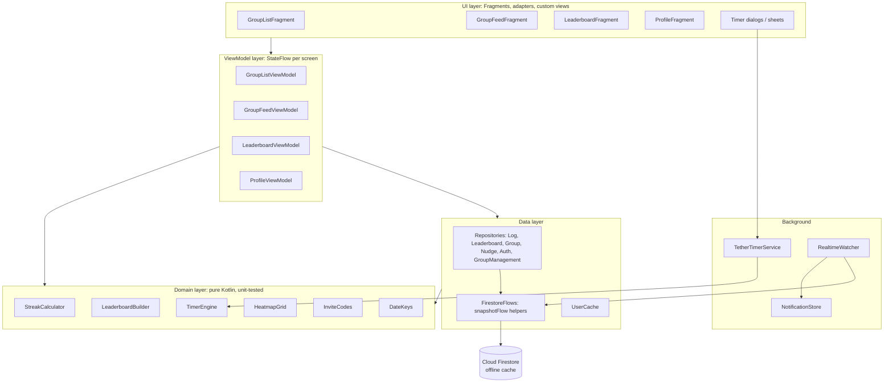
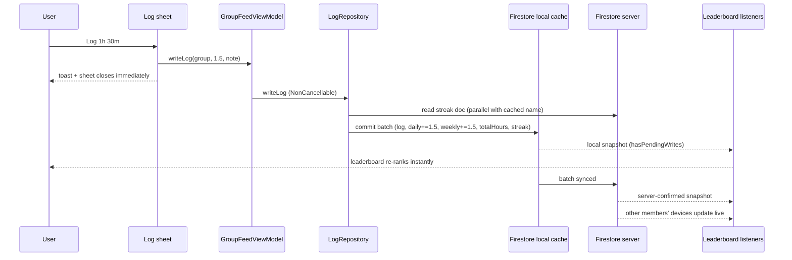

# Tether: Implementation Guide

> What has been built so far, how it works, and why it was built that way.
> Current version: **1.4.0** (versionCode 5) · Last updated: **8 Oct 2026**

---

## Contents

1. [Overview](#1-overview)
2. [Tech stack](#2-tech-stack)
3. [Architecture](#3-architecture)
4. [Data model (Firestore)](#4-data-model-firestore)
5. [Features](#5-features)
6. [Real-time data flow](#6-real-time-data-flow)
7. [Performance engineering](#7-performance-engineering)
8. [Reliability fixes](#8-reliability-fixes)
9. [Security](#9-security)
10. [Testing](#10-testing)
11. [CI/CD and releases](#11-cicd-and-releases)
12. [Local development](#12-local-development)
13. [Design decisions and trade-offs](#13-design-decisions-and-trade-offs)
14. [Known limitations](#14-known-limitations)
15. [Roadmap](#15-roadmap)
16. [Timeline](#16-timeline)
17. [Talking points](#17-talking-points)

---

## 1. Overview

Tether is a native Android social-accountability app for small friend groups (up to 6 people), aimed at college students. A group picks a goal (study, coding, gym, reading, work, habits or anything else); members log progress, say what they did (optionally with a photo friends can ✓ or 🤨), keep per-group streaks, compete on a leaderboard that resets every day, nudge friends who've gone quiet, and run focus sessions with a built-in timer.

Since v1.2, progress can also be **verified from connected accounts** instead of only self-reported. LeetCode is the first source. Solves sync automatically, and in Coding groups they count in the core loop: a solve keeps your streak alive, the leaderboard can rank problems solved, and every member's row shows their verified solves. Integrations are scoped to the group's goal, so a Gym or Study group never sees coding features.

| | |
|---|---|
| Platform | Android 8.0+ (minSdk 26, targetSdk 36) |
| Codebase | ~6,800 lines of Kotlin, 70 source files, 25 layouts |
| Backend | Firebase Spark plan (Firestore, Auth, Crashlytics, Remote Config); no custom server |
| Tests | 87 JVM unit tests + 97 Firestore security-rule tests (including one per audited exploit) + a daily LeetCode API canary |
| Distribution | Sideloaded APK from GitHub Releases |

---

## 2. Tech stack

| Area | Choice |
|---|---|
| Language | Kotlin 2.2 |
| UI | XML layouts + View Binding, Material 3 (dark theme) |
| Navigation | Navigation Component, single Activity, saved/restored tab back stacks |
| Architecture | MVVM + Repository + a pure domain layer |
| Async | Coroutines, `Flow`/`StateFlow`, `callbackFlow` wrappers over Firestore listeners |
| Backend | Cloud Firestore (asia-south1), Firebase Auth (email/password + Google) |
| Background work | Foreground service (`specialUse`) for the timer; WorkManager for LeetCode sync; app-scoped coroutine watcher for events |
| Integrations | LeetCode public GraphQL API (on-device, `HttpURLConnection` + `org.json`), Firebase Remote Config for query hot-fixes and a kill switch |
| Crash reporting | Firebase Crashlytics (release builds only; R8 mapping uploaded at build time) |
| Build | Gradle 9.3 (Kotlin DSL), AGP 9.1, R8 full shrinking, ProfileInstaller baseline profiles |
| Testing | JUnit 4; Firestore emulator + `@firebase/rules-unit-testing` + `node:test` |
| CI/CD | GitHub Actions |

---

## 3. Architecture



**Layer rules**
- **Fragments** render state and forward clicks. They collect flows inside `repeatOnLifecycle(STARTED)`, so nothing updates hidden views and listeners pause when the app is in the background.
- **ViewModels** expose `StateFlow`s built with `stateIn(viewModelScope, WhileSubscribed(5_000), …)`. Data survives navigation and configuration changes, and the 5-second grace period keeps listeners alive through quick screen switches.
- **Domain objects** contain the business rules (streaks, ranking, pace, timer phases, heatmap layout) and have no Android or Firebase dependencies, which is why they can be unit-tested.
- **Repositories** own every Firestore path. Multi-document writes always go through a `WriteBatch` or a transaction.

### Package map

```
com.tether.app
├── MainActivity            navigation host, tab handling, notification deep links
├── SplashActivity          ~1.1 s animated intro → onboarding or main
├── Onboarding*             6-slide ViewPager2 walkthrough (first launch only)
├── data/
│   ├── FirestoreFlows.kt   DocumentReference/Query → Flow (cache-first, error-tolerant)
│   ├── UserCache.kt        in-memory display name of the signed-in user
│   ├── model/              Group, Log, User (Firestore-mapped data classes)
│   ├── leetcode/           API client, response parser, Remote Config, sync state
│   └── repository/         Auth, Group, GroupManagement, Log, Leaderboard, Nudge,
│                           LeetCode, Completion, Member, CodingStats, Board
├── domain/                 StreakCalculator, LeaderboardBuilder, InviteCodes,
│                           SolveMerger, SyncBackoff, SolveCounts, LeetCodeUsernames,
│                           LeetCodeVerification, Interests
├── sync/                   LeetCodeSyncWorker (WorkManager)
├── timer/                  TimerEngine (pure), TetherTimerService, mode/control/note dialogs
├── ui/
│   ├── auth/               login, signup, Google sign-in, password reset
│   ├── group/              create / join a group
│   ├── home/               group list, group screen ("feed"), notifications sheet
│   ├── leaderboard/        leaderboard tab, shared ranked-list adapter
│   ├── log/                manual log bottom sheet
│   └── profile/            profile, connected accounts, HeatmapView + HeatmapGrid, About, FAQ
└── utils/                  DateKeys, Formatters, RealtimeWatcher, NotificationStore,
                            TetherToast, navigation/dialog guards
```

---

## 4. Data model (Firestore)

```
users/{uid}                     ← public profile: no email, no group list
  uid, name, totalHours, leetcodeUsername?, interests[]?, targets{area: hours}?, stage?
  completions/{key}             key, title, slug, source ("leetcode"; legacy "self"),
                                completedAt, syncedAt, userName
  meta/completionIndex          items: { key: { s: source, t: completedAt } }   ← 1 read per member
  heatmap/{yyyy}                { "yyyy-MM-dd": hours }                        ← owner only

inviteCodes/{code}              groupId, createdBy   ← fetched one code at a time, never listable

groups/{groupId}
  id, name, goalType, members[] (max 6), inviteCode ("" for solo),
  createdBy, solo, createdAt, metric ("hours" | "solves"; Coding groups),
  proof ("off" | "optional" | "required")

logs/{logId}
  id, userId, groupId, userName, userInitials, avatarColorHex,
  date ("yyyy-MM-dd"), value (hours, 0 for system logs), note (required for real work),
  createdAt, source ("manual" | "timer" | "system"), hasPhoto

groupStats/{groupId}/
  daily/{yyyy-MM-dd}            { <uid>: hours, log_<uid>: logId }   ← each increase cites its log
  proofs/{logId}                uid, date, createdAt (server), image (bytes ≤ 150 KB)   ← 24 h
  reactions/{logId}_{uid}       logId, uid, date, kind ("ok" | "doubt")
  weekly/{yyyy-Www}             { <uid>: hours, log_<uid>: logId }
  streaks/{uid}                 currentStreak, longestStreak, lastLogDate
  nudges/{date}_{from}_{to}     nudgerUid, nudgerName, nudgedUid, groupId, date, timestamp
```

**Why pre-aggregated stats?** The leaderboard reads one small document per day instead of scanning raw logs: O(1) reads per screen, regardless of how many logs exist. Counters use `FieldValue.increment()`, so concurrent logs from different members never overwrite each other.

**Date keys** are always formatted with `Locale.US` (identical on every device). Week keys use the calendar *week-year*, so the last days of December don't collide with week 1 of the same year.

**Queries in use.** All of these are equality-only, so no composite index is needed:

| Query | Used by |
|---|---|
| `groups where members array-contains me` | home list, leaderboard group picker, profile (membership lives on groups) |
| `inviteCodes/{code}` (single get) | joining |
| `users where documentId in members` | leaderboard names |
| `users/me/heatmap/{year}` (single get) | profile heatmap + today's hours |
| `logs where groupId == G and date == today` | activity watcher |
| `groupStats/G/nudges where date == today` | "already nudged" state |
| `groupStats/G/nudges where nudgedUid == me and date == today` | incoming nudges |
| `users/U/meta/completionIndex` (single get per member) | Coding groups: solves per member; profile LeetCode heatmap |
| `users/U/completions where syncedAt > appStart` | friends' new solves in the activity feed |
| `users/me/completions where documentId in [recent slugs]` | sync: which recent solves are new |
| `groupStats/G/reactions where date == today` | Today list reactions |
| `groupStats/G/proofs/{logId}` (single get, lazy) | a photo on screen |
| `groupStats/G/proofs where uid == me` | deleting your own older photos |
| `groupStats/G/weekly/{week}` (one per group) | Said vs. Did |

**Bundled data (assets):** `leetcode/queries.json` (the GraphQL queries, shared with the CI canary).

---

## 5. Features

### 5.1 Authentication
- Email/password signup and login. Google Sign-In (`play-services-auth`), with the account picker forced on every attempt.
- "Forgot password?" sends a Firebase password-reset email to the entered address.
- The user document is created on first sign-in.
- The session persists across launches. The navigation graph's start destination is chosen at launch (`groupList` if signed in, `auth` otherwise), so signed-in users never see the auth screen flash.
- Logout signs out, clears the in-memory caches and restarts `MainActivity` with a cleared task. No stale screens or back-stack entries from the previous user remain.

*Files:* `AuthRepository`, `AuthViewModel`, `AuthFragment`, `MainActivity.setupNavController/logout`

### 5.2 Splash and onboarding
- Splash: logo bounce → wordmark → tagline, with the steps overlapped (about 1.1 s; previously about 2 s). It routes straight to onboarding on first launch, otherwise to the main screen.
- Onboarding: 6 slides (`ViewPager2` with a depth/scale transformer, animated dot indicators, pulsing "Get Started"). Completion is stored in `tether_prefs`.

### 5.3 Groups
- **Create:** name + goal (Study / Gym / Coding / Reading / Work / Habits / Other, matching the focus areas), optionally solo. The group document and the creator's `groupIds` are written in one atomic batch. The 6-character invite code (A–Z, 0–9) is checked for uniqueness before use.
- **Join:** the invite code is normalized (case, spaces and dashes ignored), then a **transaction** re-reads the group and enforces: not already a member, not full (6), not solo. It then updates the member list and the user's `groupIds` together, so two people can't take the last spot at once.
- **Leave / delete:** both are atomic batches. Only the creator can delete. Security rules stop a user editing other members' documents, so other members' apps remove a deleted group's id from their own `groupIds` automatically, when a server snapshot shows the group no longer exists.
- **Invite code:** the ⓘ button on the group screen (hidden for solo groups) shows the code, and tapping it copies the code to the clipboard.
- **System logs:** creating or joining writes a 0-hour log ("Created the group! 🚀" / "Joined the group! 👋").

*Files:* `GroupRepository`, `GroupManagementRepository`, `GroupFragment`, `GroupListFragment`, `GroupFeedFragment`, `InviteCodes`

### 5.4 Logging hours (manual)
- Bottom sheet with hour (0–12) and minute (5-minute steps, wrapping) steppers, a required "What did you do?" note and a photo box (section 5.16). At least 5 minutes is required.
- `LogRepository.writeLog` reads the user's name (cached in memory) and current streak **in parallel**, then commits **one batch**: log document (+ proof photo) + daily stat + weekly stat + `totalHours` + heatmap + streak.
- Firestore applies the batch to its local cache immediately (latency compensation), so the leaderboard updates instantly. The write runs in a `NonCancellable` context, so it completes even if the user leaves the screen straight away.
- If the streak document can't be read (offline, never cached), the log still goes through instead of failing.

### 5.5 Focus timer
**Modes:** Stopwatch (open-ended, with optional 5- or 10-minute breaks) and Pomodoro (25/5 or 50/10, cycling until stopped). Only focus time is logged.

**`TimerEngine` (pure state machine)**
- Holds an immutable `TimerState` (mode, phase, completed focus time, phase start/end timestamps on a monotonic clock).
- `advance(state, now)` walks through *every* phase boundary that has passed. A phone asleep for 2 hours in Pomodoro comes back with exactly the right phase and focus total.
- A stopwatch break that is noticed late still resumes focus at the moment the break ended.
- Break warning fires once, at 2 minutes left.
- `restoreAfterSave` shifts timestamps after a reboot (the monotonic clock restarts at 0) using the wall clock.

**`TetherTimerService` (Android shell)**
- Foreground service. Its state is persisted to SharedPreferences on every change.
- If the process is killed (common on MIUI/HyperOS), the session is restored on the next app launch, or by the system's sticky restart when that's allowed.
- The notification uses the **system chronometer**: Android ticks the clock itself, and the app re-posts the notification only on phase changes (previously every second). It is shown immediately and tapping it opens the group.
- The current session is exposed as a `StateFlow<String?>` (`activeGroupId`), which the group screen's "Start Session / Session Active ●" chip observes. There's no polling and no stale state.

**Flow:** Start Session → mode dialog → service starts → control sheet (live display, breaks, Stop) → Stop returns the focused seconds as a fragment result → note dialog → log.
- The note dialog can't be dismissed by tapping outside, since that would silently lose the session.
- Sessions under 1 minute show "too short to log". Over 24 hours shows "left running?". Neither is logged.
- A session is logged to the group it was **started in**, even if it's stopped from another group's screen.

### 5.6 Leaderboard
- **Group screen:** members ranked by today's hours, with rank colours (gold/silver/bronze plus trophy badge), streak, pace chip and today's hours.
- **Leaderboard tab:** the same list with a **Today / This Week** toggle (Today is the default), a **group picker** (tap the group name) and an empty state.
- **Real-time:** `LeaderboardRepository` combines listeners on the group document, member names (`whereIn`), today's/yesterday's/this week's stats, the streaks collection and today's nudges. `LeaderboardBuilder` turns these into ranked rows. Changes from anyone in the group appear live.
- **Midnight reset:** the flow is driven by `DateKeys.todayFlow()`, which emits again just after midnight. Listeners re-subscribe to the new day automatically, with no app restart.
- **Pace chip:** "1h 30m behind yesterday" appears only when yesterday's hours were over 30 minutes and today's are lower. It disappears once you catch up.
- **Smooth updates:** `ListAdapter` + `DiffUtil` rebind only changed rows and animate rank changes. The rank is part of each row's data, so moved rows always show the right number.

### 5.7 Streaks
- Per group: `groupStats/{gid}/streaks/{uid}`.
- `StreakCalculator.afterLog`: logged today → unchanged; logged yesterday → +1; otherwise → 1. The longest streak is kept.
- `StreakCalculator.displayed`: the stored value counts only if the last log was today or yesterday, otherwise it shows 0. The stored value only changes when someone logs, so a missed day would otherwise keep showing an old streak. The same rule is used on the leaderboard and on the profile ("best active streak").

### 5.8 Nudges
- Tap a member's avatar (group screen or leaderboard tab) to nudge them. The avatar dims once nudged, and a second tap says "Already nudged today ✓".
- Stored at `groupStats/{gid}/nudges/{date}_{from}_{to}`. The deterministic id enforces one nudge per person per day, and re-sending simply overwrites the same document.
- **Delivery:** `RealtimeWatcher` listens, per group, for nudges addressed to you today and posts a high-priority notification that opens the group. This works while the app process is alive, including in the background. Delivery to a fully closed app needs server push (see [Roadmap](#15-roadmap)).

### 5.9 Activity feed (bell)
- `RealtimeWatcher` listens to today's logs in each of your groups and records "Asha logged 1h 30m in Study Squad: Solved 3 graph problems 📷" and "Rahul joined Study Squad 👋" in `NotificationStore` (SharedPreferences, resets daily). Your own logs and other 0-hour system logs are ignored.
- The bell's unread dot observes a `StateFlow`. The sheet lists today's events, newest first.
- Each event is handled exactly once: a set of seen ids plus a "created after the app started" check. Exactly one watcher exists; it's reference-counted across activity instances, which matters on logout, when the new activity is created before the old one is destroyed.

### 5.10 Profile and heatmap
- Name, email, initials avatar, best active streak, today's hours and number of groups. The name is shown immediately from the auth profile, then refined from Firestore.
- **One document per year** (`users/me/heatmap/{yyyy}`, incremented in the same batch as each log) drives both the heatmap and today's hours. With LeetCode connected, a toggle switches the heatmap to solves per day (section 5.12).
- **`HeatmapView`** is a custom `View` drawing the full calendar year on a `Canvas`: Monday-first columns, month labels, a 13-level green scale (one level per hour; 12h or more is brightest). It replaces a `TableLayout` of about 420 child views. The layout maths lives in the pure `HeatmapGrid`. It opens scrolled to the current week.
- About (app description and builder card with GitHub/LinkedIn links) and FAQ (8 expandable questions).

### 5.11 Connected accounts: LeetCode
**Why:** hours are self-reported and easy to game. A connected account turns claims into verified progress. Integrations are scoped by goal, so coding is one module, not the app's identity.

- **Connect:** Profile → Connected accounts → enter a handle, `@handle` or profile URL (`LeetCodeUsernames.normalize`). The handle is checked against LeetCode and saved on the user. No ownership step is needed to start syncing.
- **Ownership proof (v1.3):** Manage → Verify ownership shows a code derived from the user id (`LeetCodeVerification.ownershipCode`, `tether-` + 6 hex chars of SHA-256). The user pastes it into their public LeetCode bio. **Every viewer re-checks the bio**, so a squatter who connects someone else's handle is shown as "owner unverified". This replaced a first-come handle-claim collection that let anyone squat a handle (audit #8).
- **Claim cross-checks (v1.3):** a user's own device writes their "verified" completions, so viewers cross-check them against LeetCode's public data (`LeetCodeVerification.unconfirmedClaims`):
  - more verified claims than LeetCode's solved total → none are trusted;
  - a recent list shorter than 20 is the user's whole history, so any claim missing from it is fake;
  - otherwise, claims dated inside the window the list covers must appear in it.
  Contradicted claims don't count towards solves, rankings or the heatmap, and the member shows "⚠ N unconfirmed" (audit #7).
- **What's read:** only public data, through LeetCode's GraphQL endpoint (the API leetcode.com itself uses). Profile stats (solved by difficulty, streak, active days, topic counts) and the most recent 20 accepted submissions.
- **Where solving happens doesn't matter:** LeetCode's servers hold the result, and the phone reads it. Solving on a laptop needs no logging at all.
- **Sync** (`LeetCodeRepository.sync`, run by `LeetCodeSyncWorker`): every 3 h on any network (WorkManager, survives reboots), plus on app open, on connect and on "Sync now". It fetches recent solves, looks up which slugs already exist (one `whereIn` query) and lets `SolveMerger` decide the writes:
  - new solves become verified completions;
  - a legacy self-ticked item seen on LeetCode is upgraded to verified, keeping the earlier date;
  - repeat solves count once.
  Writes are one batch.
- **Designed for an unofficial API:**
  - Requests come from users' phones, low volume, so there's no server IP to get blocked.
  - Queries live in `assets/leetcode/queries.json` and can be replaced remotely via Remote Config (`leetcode_profile_query`, `leetcode_recent_query`). A renamed field is fixed by aliasing it back, with no APK release.
  - Remote kill switch: `leetcode_sync_enabled`.
  - Exponential backoff (`SyncBackoff`: 15 min doubling to a 24 h cap), persisted in `LeetCodeSyncState`. The app shows "Sync paused: …" and everything else keeps working.
  - Parser failures become `LeetCodeSchemaException` instead of crashes.
  - A daily GitHub Actions canary validates the app's exact queries against LeetCode's schema (section 11).
- **Trust:** friends' LeetCode data (totals, recent solves, bio) is fetched **directly from LeetCode** by each viewer (10-minute cache), not read from Firestore. Editing the database can't inflate them.
- **Profile row + LeetCode page (v1.4):** the profile shows one summary line (handle, ✓, solved count, sync status). Tapping it opens a dedicated page (`LeetCodeFragment`) with solved by difficulty, streak, active days and rank, strongest topics, sync status with **Sync now**, the ownership step (tap-to-copy code) and Disconnect.

*Files:* `data/leetcode/*`, `LeetCodeRepository`, `LeetCodeSyncWorker`, `ConnectedAccountsViewModel`, `ProfileFragment`

### 5.12 LeetCode in the core loop (Coding groups)
**Why:** an earlier version bundled problem sheets (NeetCode 150, Striver's A2Z, Rising Brain) to tick through. They were removed: anyone following a sheet already tracks it on the sheet's own site, so Tether would only have duplicated it. What a sheet can't do is make **friends** accountable. So LeetCode now feeds the parts of Tether that already create accountability: streaks, the leaderboard and the heatmap. It does this only in groups whose goal is Coding (`CodingStatsRepository.isCodingGoal`).

- **Streak credit:** after a sync writes a solve dated today, `LeetCodeRepository.creditStreaks` advances your streak in every Coding group you haven't already logged in today. It uses `StreakCalculator.afterLog`, the same rule as logging hours, and the existing streak rule validates the write. Solving on a laptop keeps the streak alive with nothing to log.
- **Ranking metric:** a Coding group's creator chooses whether the leaderboard ranks **hours logged** or **problems solved** (⋮ → Rank leaderboard by…). This is stored as `groups/{id}.metric` (`"hours"` | `"solves"`). The security rules allow only the creator to change it, and new groups always start on hours. When ranking by solves, today's or this week's solves come first and hours break ties.
- **Every member's row** in a Coding group shows "🧩 N solved today" (or "this week") plus a trust note:
  - ✓ LeetCode verified (the ownership code is in their bio);
  - ⚠ N unconfirmed (claims contradicted by LeetCode's public data);
  - @handle (connected but not verified);
  - LeetCode not connected.
  The same `BoardRepository` drives the group screen and the Leaderboard tab.
- **Counting** (`SolveCounts`, pure and unit-tested): only verified LeetCode completions count, and claims that the viewer's cross-check contradicts are dropped. The legacy `"self"` entries from the retired sheets are parsed but never counted.
- **Pipeline:**
  - `CodingStatsRepository` combines members' handles (`MemberRepository.observeMembers`), their completion indexes (one document each) and the date (`DateKeys.todayFlow`, so counts roll over at midnight).
  - It emits counts immediately, then emits again once `LeetCodeRepository.checkMembers` has fetched each member's live profile and recent solves in parallel (10-minute cache).
  - `BoardRepository` switches between the plain hours board and the hours-plus-solves board with `flatMapLatest`, whenever the group's goal, metric or members change.
- **Profile heatmap toggle:** when LeetCode is connected, the heatmap card toggles between hours logged and problems solved per day (`SolveCounts.byDay` over your own completion index).
- **Activity feed:** friends' newly synced solves appear in the bell ("Asha solved LRU Cache ✓").

*Files:* `CodingStatsRepository`, `BoardRepository`, `MemberRepository`, `CompletionRepository`, `SolveCounts`, `LeaderboardBuilder.withSolves`, `LeetCodeRepository.creditStreaks`, `GroupFeedFragment` (metric picker), `ProfileFragment` (heatmap toggle)

### 5.13 Focus areas: "Said vs. Did" (v1.4)
**Why:** in v1.3, focus areas only pre-selected a goal when creating a group, so picking several did nothing visible. Now they're what you hold yourself to.

- After the first sign-in (and any time via Profile → Said vs. Did → Edit), one screen asks **"What do you want to stay accountable for?"** (Coding / DSA, Studies & exams, Fitness, Reading, Work & projects, Habits) and a **weekly target in hours** for each chosen area (stepper, 1–60 h, default 5 h). There's also an optional stage (Student / Working / Other).
- **One taxonomy:** every focus area has exactly one group goal (Coding, Study, Gym, Reading, Work, Habits). Group creation offers all six plus "Other", and `Interests.areaForGoal` maps a group to its area. Hours in "Other" groups count toward no area.
- **The profile card** shows each area's hours this week against its target, with a progress bar and a status line (`SaidVsDid`, pure and unit-tested):
  - **✓ Target hit**;
  - **On track:** within 80% of an even pace for the day of the week;
  - **Behind pace:** with the hours needed to catch up;
  - **"You said this matters. Nothing logged yet this week."**;
  - **No group yet:** none of your groups has that goal, so nothing can count.
- **Data:** your hours per group come from the existing `groupStats/{g}/weekly/{week}` documents (one live listener per group, so a handful of reads). Targets are stored on the user doc as `targets: { area: hours }`. Nothing new is written per log. The week rolls over with `DateKeys.todayFlow`.
- Skipping counts as an answer, so it's asked once.

*Files:* `Interests`, `SaidVsDid`, `ProfileRepository` (`FocusPlan`), `ProfileViewModel.saidVsDid`, `InterestsFragment`, `ProfileFragment`

### 5.14 Account and privacy (v1.3)
- **Delete account** (Profile; a Play Store requirement), in a safe order:
  1. Groups first: the creator hands the group to the next member, or deletes it if they're alone.
  2. Then logs, completions and the index, heatmap and profile.
  3. Then the Firebase Auth login.
  Firebase only deletes logins after a recent sign-in, so that's checked **before** any data is touched, which avoids half-deleted accounts.
- **Email verification:** a link is sent at signup, and Profile shows "Email not verified · Resend link" for password accounts.
- **Missed events:** nudges and activity from earlier today, including while the app was closed, appear in the bell when the app opens. Events are de-duplicated by id. System notifications are only shown for live nudges.

### 5.15 One-time data migration (v1.3)
`Migrations.runIfNeeded` runs once per user per device after sign-in. Every step is idempotent and merge-based, so it's safe to retry and safe to race with a sync:
1. Remove the email and group list from the public profile (and create the profile if it's missing).
2. Create missing `inviteCodes/{code}` documents for existing groups; any member may, and the rules check the code matches the group.
3. Build the completion index from per-item documents.
4. Rebuild this year's heatmap document from the user's own logs.

### 5.16 Proof: what you did, photos and reactions (v1.4)
**Why:** "I logged 2 hours" isn't accountability on its own. Each log now says what was done, can carry a photo, and friends can back it or question it.

- **"What did you do?" is required** on every log (3–200 characters), in the log sheet and in the timer's end-of-session dialog. The security rules enforce it too.
- **Photo proof, set per group by the creator** (⋮ → Photo proof):
  - **Off;**
  - **Optional (default):** members can add a photo;
  - **Required:** every manual log needs a photo, taken with the **camera only** (no gallery), so it's fresh. The header shows "📷 photo required".

  Focus-timer sessions are exempt, since the timer measured the time.
- **Free photo storage on the Spark plan.** Cloud Storage for Firebase now needs the Blaze plan, so photos live in Firestore instead:
  - **On the phone** (`ProofImage`): a subsampled decode (a 12 MP photo is never fully loaded), EXIF rotation applied, scaled to 720 px, and re-encoded as JPEG, lowering quality until it's ≤ 120 KB (usually ~60 KB). Re-encoding also strips EXIF metadata, including GPS location.
  - **Stored** as `Bytes` in `groupStats/{g}/proofs/{logId}`, written **in the same batch as the log**. The log only carries `hasPhoto`, so feed listeners never download image bytes.
  - **Loaded lazily:** a single `get` when a log with a photo is on screen, decoded off the main thread and kept in a 16 MB LRU cache (cleared on logout). Tap for full screen.
  - **Same day only:** the rules stop serving a photo 24 h after the **server** time it was taken (`createdAt == request.time` on create). The app only shows today's logs, and opening a group deletes your own older photos (`deleteMyOldProofs`). Storage stays tiny: even at 200 photos a day, about 15 MB.
- **Camera flow:** the system camera app via `ActivityResultContracts.TakePicture` and a `FileProvider` in the app's cache, so no CAMERA permission is needed. If Android kills Tether while the camera is open, the sheet is recreated with its state and the result still arrives (fixed file path, saved hours/minutes). Optional groups also offer the system photo picker (no storage permission).
- **Today list** on the group screen: who logged what today, newest first, with time, what they did, ⏱ for timer sessions and the photo.
- **Reactions:** tap **✓** to back a friend's log or **🤨** to question it; tap again to remove.
  - Stored at `groupStats/{g}/reactions/{logId}_{uid}`, so the id makes it one reaction per person per log.
  - The rules check you're a member, the log is in that group, it's not your own, and it's from today.
  - Reactions are social only: they don't change hours.
- **Bell:** activity now reads "Asha logged 1h 30m in Study Squad: Solved 3 graph problems 📷".

*Files:* `Proof`, `ProofImage`, `ProofRepository`, `TodayRepository`, `LogRepository`, `LogBottomSheetFragment`, `TimerNoteDialogFragment`, `TodayLogAdapter`, `GroupFeedFragment/ViewModel`, `RealtimeWatcher`

---

## 6. Real-time data flow

Logging an hour, end to end:



Snapshot listeners deliver **cached data first, then server data**, so every screen renders immediately and then corrects itself. `FirestoreFlows` turns listener errors (for example a missing permission) into `null` emissions instead of closing the flow, so one failing source can't block a whole screen.

---

## 7. Performance engineering

| Problem | Before | After |
|---|---|---|
| Leaderboard reads | Every change re-fetched the group, 2 stats docs and **3 docs per member**, sequentially from the server | A fixed set of listeners combined in memory; no re-fetching |
| Logging | 7 sequential awaited writes; the leaderboard updated only after server round trips | 1 atomic batch, applied to the local cache instantly |
| Returning to home | List hidden, then reloaded with N sequential `get()`s | ViewModel keeps the list; cache-first listener |
| Tab switches | Destinations recreated, data reloaded | Tab back stacks saved/restored with their ViewModels |
| Heatmap | ~420 views in a `TableLayout` | One `Canvas`-drawn view |
| Timer notification | Re-posted every second | System chronometer; re-posted only on phase change |
| Lists | `notifyDataSetChanged()` / new adapter per update | `ListAdapter` + `DiffUtil` |
| Toasts | Queued behind each other | The new one replaces the old one |
| Startup | ~2 s splash + extra activity hop | ~1.1 s splash, direct routing, no auth flash |
| APK / runtime | Debug-style build, no shrinking | R8 + resource shrinking (14.8 MB → 6.7 MB), baseline profiles via ProfileInstaller |
| Overdraw | Window + root both painted the background | Window background removed in `MainActivity` |
| Activity listeners | A new set added on every home visit, never removed | One app-scoped watcher, restarted only when groups or day change |

---

## 8. Reliability fixes

**Data and logic**
- Nudge notifications were never delivered: a `collectionGroup("nudges")` query couldn't match the old path, and the listener didn't start if you logged in during that launch. Nudges were redesigned (see 5.8).
- Group deletion with more than one member failed halfway (rules block editing other users' documents). It's now one batch, with lazy cleanup by the other members' apps.
- The 6-member cap could be exceeded by simultaneous joins. Joining is now a transaction, also enforced in the security rules.
- Joining a group posted a "logged 0m" activity notification. Joins now read "X joined G".
- The profile streak ignored broken streaks. It now uses the shared `StreakCalculator.displayed` rule.
- Week keys would have merged late-December hours into January's week 1. The key now uses the week-year.
- Date keys depended on the device locale. They're now fixed to `Locale.US`.
- Invite codes typed with dashes (as the input hint shows) didn't match. They're now normalized.

**Timer**
- Time was counted by ticks. It's now computed from timestamps, so it's exact through sleep and delayed ticks.
- A killed process lost the session, and a sticky restart created a phantom empty session. State is now persisted and restored; empty restarts stop themselves.
- Tapping outside the note dialog dropped the session.
- A session stopped from another group's screen was never logged.
- Cancelling the mode dialog left the chip stuck on "Session Active".
- Very short sessions logged "0m". Sessions over 24 hours could be logged.

**UI and navigation**
- Back after logout returned to the signed-out user's profile. Logout now restarts the activity with a cleared task.
- The bottom-nav highlight drifted after pressing back. It's synced in the destination listener, without retriggering navigation.
- Double-taps crashed navigation ("destination unknown") or opened duplicate dialogs. Added `navigateSafe` and `showOnce` guards.
- The group menu could offer "Leave" to the creator before the group had loaded.
- Error toasts re-appeared when screens were recreated. Errors are now one-shot events (`Channel`), consumed after display.
- "Forgot password?" did nothing.
- Onboarding fragments were pre-instantiated, which can crash on restore. They're now created on demand.

---

## 9. Security

[`firestore.rules`](../firestore.rules) is written to mirror every access path in the app:

| Data | Read | Write |
|---|---|---|
| `users/{uid}` | signed-in users (public profile only: name, totals, handle, focus areas, targets) | owner only; fixed fields; `targets` a map of ≤ 8; legacy `email`/`groupIds` can only be removed; owner can delete |
| `users/{uid}/completions`, `meta` | signed-in users (members count solves) | owner only; source must be "leetcode" and the slug must equal the key |
| `users/{uid}/heatmap/{year}` | owner only | owner only |
| `inviteCodes/{code}` | **get only** (must know the code); never listed | created only for a group you're in, matching its code; never overwritten; deleted by the creator |
| `groups/{id}` | get by id; **list only groups you're a member of** | create as sole member and creator; members add or remove **themselves** (≤ 6, not solo); the creator can't just leave (hand over or delete); only the creator sets the ranking metric (hours/solves) and the photo mode (off/optional/required); new groups start on hours |
| `logs/{id}` | **your own, or logs of groups you're in** | create as yourself, in your group, 0–24 h, **dated today by the server clock**; real work says what was done (3–200 chars); `hasPhoto` must match a proof created in the same batch; in "required" groups manual logs need one; delete your own; no edits |
| `groupStats/{g}/proofs/{logId}` | members, **only within 24 h of the server time it was taken**; list only your own (cleanup) | created only together with its new log (same user, group, date, `hasPhoto`); bytes ≤ 150 KB; server timestamp; never edited; owner deletes |
| `groupStats/{g}/reactions/{logId}_{uid}` | members only | members; as yourself; ✓ or 🤨; on a log in this group from today that isn't yours; remove your own |
| `groupStats/{g}/daily`, `weekly` | members only | members; only your counter; **each increase must equal a log created in the same batch**; totals capped at 24 h/day and 168 h/week; date must be today |
| `groupStats/{g}/streaks/{uid}` | members only | own doc; **valid moves only**: unchanged on the same day, +1 for exactly the next day, otherwise 1; longest ≤ max(old, current) |
| `groupStats/{g}/nudges/{id}` | members only | members; from you, to another member, dated today; id = `date_from_to` |
| anything else (incl. the retired `leetcodeUsernames` and legacy `nudges`) | denied | denied |

### The October 2026 audit
I attacked my own rules in the emulator and **8 exploits succeeded**. Each one now has a permanent "blocks" test (marked `[audit #n]`):

| # | Exploit | Fix |
|---|---|---|
| 1 | Any user could list every group and read its invite code | Codes moved to `inviteCodes/{code}` (get-only); group lists require `members array-contains me` |
| 2 | Any user could download every email | Emails removed from public profiles (kept in Firebase Auth only) |
| 3 | Any user could read every log note | Logs readable by the author or the group's members only |
| 4 | Repeated +24 h writes pushed a day past 24 h | Absolute caps: 24 h/day, 168 h/week |
| 5 | Streaks could be set to any value | Streak transitions validated against dates |
| 6 | Leaderboard hours could rise without a log | Every increase must cite a new log of the same amount, in the same batch |
| 7 | Fake "verified" LeetCode completions | Slug must equal key; viewers cross-check claims against LeetCode's public data |
| 8 | Anyone could squat a LeetCode handle | Claims removed; ownership proven by a bio code that every viewer re-checks |

Also fixed: backdating with a wrong phone clock (dates checked against server time), creators orphaning groups, and the open legacy nudge path.

Rules are tested against the emulator: **97 cases**, replaying the app's real batches and transactions plus every abuse case above. Deploy with `firebase deploy --only firestore:rules` after the tests pass.

---

## 10. Testing

**Unit tests** (`app/src/test`, JVM, run in seconds)

| Suite | Tests | Covers |
|---|---|---|
| `StreakCalculatorTest` | 9 | first log, same day, consecutive, gaps, longest record, month/year/leap boundaries, display rule |
| `LeaderboardBuilderTest` | 12 | ranking, stable ties, missing data, unknown users, broken streaks, nudge flags, pace labels, solve counts on rows, ranking by solves, LeetCode trust notes |
| `TimerEngineTest` | 10 | stopwatch timing, late break resume, break permissions, Pomodoro boundaries and multi-cycle catch-up, focus-only counting, break warning, reboot recovery |
| `HeatmapGridTest` | 5 | intensity levels, Monday-first grid size, cell placement, month labels, today marker |
| `DateKeysAndFormattersTest` | 7 | previous day across boundaries, week-year keys, ASCII date keys, hour formatting, initials, avatar colours |
| `InviteCodesTest` | 2 | normalization, generation format |
| `LeetCodeParserTest` | 8 | profile stats and topics, recent solves, unknown user, schema change, malformed/HTML responses, null lists (recorded, anonymised fixtures) |
| `CompletionsTest` | 9 | solve merging (new, already verified, self→verified upgrade, repeat solves), backoff schedule, username normalisation |
| `SolveCountsTest` | 4 | solves today/this week, self-reported and contradicted claims excluded, per-day heatmap counts, empty index |
| `LeetCodeVerificationTest` | 7 | ownership code stability/uniqueness, bio matching (incl. squatter), claim cross-checks (totals, short history, time window) |
| `InterestsTest` | 5 | default group goal, area ↔ goal mapping, target sanitising, option sanitising, region-independent week numbering |
| `SaidVsDidTest` | 5 | summing groups per area, "Other" excluded, pace statuses (on track/behind/done/not started), no-group areas, order and caps |
| `ProofTest` | 4 | required note, photo rules per mode (timer exempt), decode subsampling and scaling, Today list merge (reaction counts, own reactions ignored, system logs hidden) |

**Rules tests** (`firestore-tests/rules.test.js`): 97 tests across users, invite codes and groups, logging, streaks, reading group data, nudges, connected accounts and completions, proof (notes, photos, reactions), Said vs. Did and default-deny, including one test per audited exploit.

```bash
./gradlew testDebugUnitTest                       # unit tests
cd firestore-tests && npm install && npm test     # rules (needs Java 11+)
```

---

## 11. CI/CD and releases

`.github/workflows/leetcode-canary.yml` runs every day at 09:00 IST (and whenever the queries change). It sends the app's exact queries from `queries.json` to LeetCode using a username that can't exist. GraphQL validates every field before executing, so this proves the schema still matches without reading anyone's data. A failure emails the repo owner: patch the query via Remote Config.

`.github/workflows/ci.yml` has three jobs:

1. **android:** `testDebugUnitTest`, `lintDebug`, `assembleDebug`. Test and lint reports are uploaded as artifacts. Builds use the real `google-services.json` from secrets, or a placeholder for forks and PRs.
2. **firestore-rules:** Node 22 + Java 21, `npm ci`, emulator rules tests.
3. **release** (only on `v*` tags, after both jobs pass): builds a signed, R8-optimized APK and attaches it to a GitHub Release as `Tether.apk`. The README's download badge points at that file.

**Repository secrets for releases**

| Secret | Value |
|---|---|
| `GOOGLE_SERVICES_JSON` | contents of `app/google-services.json` |
| `TETHER_KEYSTORE_BASE64` | `base64` of the signing keystore (currently the debug keystore whose SHA-1 is registered in Firebase) |
| `TETHER_KEYSTORE_PASSWORD` | `android` for a debug keystore |
| `TETHER_KEY_ALIAS` | `androiddebugkey` for a debug keystore |
| `TETHER_KEY_PASSWORD` | `android` for a debug keystore |

**Cutting a release:** bump `versionCode`/`versionName` in `app/build.gradle.kts`, commit, then `git tag v1.2.0 && git push origin v1.2.0`.

Crashlytics is enabled only in release builds (manifest placeholder). The plugin uploads the R8 mapping file during `assembleRelease`, so crash stack traces are readable.

---

## 12. Local development

| Requirement | Notes |
|---|---|
| JDK 21 | Kotlin 2.2.10 isn't reliable on JDK 25 |
| Android SDK | platform 36, build-tools 36 (`local.properties` → `sdk.dir`) |
| `app/google-services.json` | from the Firebase console (gitignored) |
| Node 22 + Java | only for the rules tests |

```bash
./gradlew assembleDebug          # debug APK
./gradlew assembleRelease        # optimized APK (debug-signed locally)
./gradlew testDebugUnitTest lintDebug
```

Google Sign-In requires the SHA-1 of the signing key to be registered in Firebase. Two keys are currently registered: the original development key and the current build machine's key.

---

## 13. Design decisions and trade-offs

| Decision | Why | Trade-off |
|---|---|---|
| Pre-aggregated `groupStats` counters | O(1) leaderboard reads, safe concurrent increments | Clients write the aggregates, so their integrity relies on security rules (see Roadmap: server-side aggregation) |
| Snapshot listeners everywhere (cache-first) | Instant UI, live multi-user updates, offline support | More open listeners; mitigated by `WhileSubscribed` and lifecycle-aware collection |
| Atomic batches/transactions for multi-doc writes | No half-applied state (e.g. stats without a log) | A batch needs the streak read first (one round trip, in parallel with the name lookup) |
| Timer as pure engine + thin service | Exact, testable time-keeping; easy to reason about | Persistence and restore code to maintain |
| Nudges under `groupStats/{g}/nudges` | Covered by group-scoped rules; no collection-group rule or composite index; deterministic id = rate limit | Recipients need one listener per group (fine at ≤ a handful of groups) |
| Local notifications instead of FCM | Works on the free Spark plan, no server | No delivery when the app process is dead |
| Manual dependency wiring (constructor defaults), no Hilt yet | Keeps the AGP 9 build simple and fast | Less formal DI; Hilt is on the roadmap |
| Custom `Canvas` heatmap | One view instead of ~420; smooth scrolling | Custom drawing code (tested via `HeatmapGrid`) |
| Release signed with the registered debug key | Google Sign-In keeps working for sideloaded installs without new Firebase setup | Must switch to a dedicated upload key before publishing on Play |
| Logs readable by any signed-in user | The profile heatmap must include logs from groups you've left | Notes are visible to signed-in users who know a group id |
| LeetCode via its public GraphQL API, called on-device | Same API as leetcode.com; no server to block; free | Unofficial: mitigated by remote query patches, a kill switch, backoff and a daily canary |
| Username-only connect, with optional ownership proof | Zero friction to start; a bio code proves ownership later | Several accounts can connect one handle, but only the real owner shows ✓, and every viewer checks |
| Integrity enforced in rules (no server) | Free Spark plan; rules link stats to logs, cap totals and validate streaks | Manual hours remain self-reported (bounded and logged, but unverifiable) |
| Completion index document | 1 read per member instead of hundreds | The index must be kept in sync in the same batch as each completion |
| Friends' totals read live from LeetCode | Can't be faked by writing to Firestore | One small request per member per 10 minutes |
| LeetCode in the core loop instead of problem sheets | Feeds the parts that create accountability (streaks, ranking, heatmap) without duplicating what sheet sites already do | Users following a sheet still track it on the sheet's site |
| Proof photos as bytes in Firestore, not Cloud Storage | Free on the Spark plan (Storage needs Blaze); same security rules as everything else; atomic with the log | Photos must be small (~60 KB, 720 px) and short-lived (24 h): fine for proof, not a gallery |
| Photo mode per group, camera-only when required | Strict groups get fresh photos; casual groups aren't forced to snap their desk | A determined user can still stage a photo; friends' 🤨 is the real check |
| Focus areas = group goals (one taxonomy) | Said vs. Did needs no per-log tagging and no new writes; reads existing weekly stats | Hours in "Other" groups count toward no area |
| One dialog and menu system (`TetherDialogs`, `TetherSheet`) | Every confirmation and choice matches the app (dark card or bottom sheet, icons, red destructive actions) instead of the framework AlertDialog | Custom code instead of stock dialogs |
| Integrations scoped by group goal | Coding is a module, not the product's identity; non-coding groups stay clean | Each new goal needs its own source (e.g. Health Connect for gym) |

---

## 14. Known limitations

- **Nudges and activity events** only arrive while the app process is alive. True push to a closed app needs Cloud Functions + FCM (Blaze plan); the project deliberately stays on the free Spark plan.
- **LeetCode's public list holds only the last 20 solves.** Syncing every few hours and on app open covers normal use. Solves from before connecting aren't imported, but that doesn't matter for daily streaks and rankings.
- **Manual hours are still self-reported.** Rules now bound them (log-backed, ≤ 24 h/day, dated today), but a determined user can log hours they didn't work. Verified sources and sessions are the long-term answer.
- **Claim cross-checks are heuristic:** a fake completion dated before the recent-solves window (and within the user's real total) can't be disproven from public data.
- **Proof can be gamed at the edges:** the timer exemption relies on the client marking a log as a timer session, and a photo can be staged. Photos and reactions raise the effort to lie and make it visible to friends; they don't make lying impossible.
- **No App Check yet:** Play Integrity needs a Play Store listing. Until then, the read-cost work (indexes, single-document heatmap) is the main protection for the free quota.
- **Account deletion keeps anonymous aggregates** (numbers keyed by the old uid in `groupStats`), which no longer resolve to a name.
- **No log editing yet:** a mistaken log can be deleted only by direct Firestore access. The rules already allow deleting your own log.
- **Portrait only; dark theme only.**
- **Deleted groups** leave their `logs`/`groupStats` behind, deliberately, so the members' history and heatmaps stay intact.

---

## 15. Roadmap

Planned "lovable product" features, chosen for both student appeal and engineering depth:

All planned work fits the free Spark plan (no Cloud Functions).

1. **Group stakes:** a weekly shared target. If everyone hits their part, the group's flame grows; if one person misses, it breaks for everyone. Cooperative pressure instead of a leaderboard that the bottom half gives up on.
2. **Study Together:** live presence ("🟢 Rahul, 1h 12m into DSA") and one-tap shared sessions. Realtime Database presence with `onDisconnect`, heartbeats, stale-session cleanup (needs a Realtime Database instance).
3. **More connected sources:** Health Connect for gym goals, GitHub or Codeforces for coding, optional LeetCode ownership verification (bio code), and a Chrome extension for instant sync on "Accepted".
4. **Verified Focus:** timer sessions get a ✓ and an on-device focus score (phone pickups, time in other apps); verified and manual hours shown separately.
5. **Tether Wrapped:** weekly/semester recap card with personas (Night Owl, Weekend Warrior), week-over-week growth and a Perfect Week badge, computed on the device and shareable to stories.
6. **Quality of life:** edit/delete a log, daily streak reminder, streak freeze, home-screen widget, in-app update prompt.
7. **Engineering:** Hilt DI, a Firebase BoM 34 upgrade, a dedicated release keystore, Play Store listing.

---

## 16. Timeline

| Date | Milestone |
|---|---|
| 28 Apr 2026 | MVP screens (auth, feed, log sheet, leaderboard, groups, profile) on dummy data; Firebase project set up |
| 2 May 2026 | Firestore integration: real logging, leaderboard, group management, streaks, heatmap, focus timer |
| 3 May 2026 | Pace indicator, hours + minutes logging, notification deep link to group, feed index |
| 4–6 May 2026 | Per-group streaks, 6-member cap, nudges, Google Sign-In, logo, splash, onboarding, About/FAQ, activity bell; ~24 bug fixes |
| 11 May 2026 | Leaderboard streak staleness fix |
| 4 Oct 2026 | **v1.1.0:** performance and reliability overhaul (sections 7–8), nudge redesign, timer engine, leaderboard group picker, password reset, R8 release build |
| 4 Oct 2026 | Engineering foundation: domain layer + 42 unit tests, security rules + 38 emulator tests, Crashlytics, GitHub Actions CI/CD, this document |
| 4 Oct 2026 | **v1.2.0:** connected accounts (LeetCode sync with WorkManager, Remote Config hot-fixes, backoff, daily canary), Tracks (NeetCode 150, Striver's A2Z, Rising Brain) with group races, verified-solve activity feed; 64 unit + 53 rules tests |
| 7 Oct 2026 | **v1.3.0 (hardening + core loop):** self-audit found 8 exploits, all fixed with tests; invite codes collection; private profiles; log-backed, capped stats; validated streaks; LeetCode ownership proof and claim cross-checks; completion index and yearly heatmap doc (read costs); missed-event backfill; account deletion; email verification; focus-areas onboarding; one-time migration. Tracks removed: LeetCode now credits streaks, can rank Coding leaderboards (creator's choice), shows on every member's row and as a profile heatmap; 76 unit + 79 rules tests |
| 8 Oct 2026 | **v1.4.0 (proof + Said vs. Did):** every log says what was done; per-group photo proof (off/optional/required, camera-only when required) stored free in Firestore with an on-device image pipeline and 24 h expiry; Today list with ✓/🤨 reactions; focus areas with weekly targets compared against logged hours; six goals matching the focus areas; 87 unit + 97 rules tests |

---

## 17. Talking points

- **Real-time systems:** "The leaderboard is a reactive pipeline: seven Firestore listeners combined with Kotlin Flow, re-subscribing automatically at midnight. Replacing per-member server fetches with combined listeners removed an N+1 read pattern."
- **Consistency:** "All multi-document writes are atomic batches or transactions. Joining a group is a transaction, so the 6-member cap holds under concurrent joins, and it's also enforced in security rules."
- **Correct time-keeping:** "The timer is a pure state machine over monotonic timestamps. It's exact through device sleep, catches up across multiple Pomodoro cycles, survives process death through persisted state, and handles reboots by re-basing the clock. All of it is unit-tested."
- **Security:** "The security rules mirror the app's access paths: users can only increase their own counters by at most 24 hours per write, and only in groups they belong to. Emulator tests replay the app's real batches plus abuse cases."
- **Performance:** "I profiled the slowness down to sequential server round trips and view-heavy rendering, moved to cache-first listeners, atomic local-first writes, DiffUtil and a Canvas-drawn heatmap, and enabled R8 plus baseline profiles. The APK shrank from 14.8 to 6.7 MB."
- **Unreliable third-party APIs:** "LeetCode has no official API, so I designed for failure. Queries can be patched remotely without an app release, there's a remote kill switch, sync backs off exponentially, parser errors degrade gracefully, and a daily CI canary checks the schema before users notice. Requests come from users' own phones, so there's no server IP to get blocked."
- **Trust without a server:** "Friends' totals are read straight from LeetCode by each viewer, so nobody can inflate them by writing to the database; Firestore is only a cache. Ownership is proven with a code derived from your user id in your public LeetCode bio, which anyone can re-check, and claimed solves are cross-checked against LeetCode's public data."
- **Security mindset:** "I audited my own app, proved 8 exploits against the Firestore emulator (listing every group's invite code, dumping emails, inflating leaderboards, forging streaks), fixed each one, and turned each exploit into a permanent regression test. Leaderboard increases now have to cite a new log of the same amount, created in the same atomic batch."
- **Cost awareness:** "On Firebase's free plan, counting a group's solves was reading hundreds of documents per member, so about 30 users would have exhausted the daily quota. A per-user index document made it 1 read per member."
- **Product thinking:** "I built problem sheets, then removed them: nobody needs a second place to tick off Striver's sheet. Instead, LeetCode feeds what Tether is actually for: a solve keeps your group streak alive, a Coding group can rank by verified solves, and friends see each other's progress. Integrations are scoped to a group's goal, so a gym group never sees any of it. It's an accountability app with verified sources, not a placement-prep app."
- **Working within constraints:** "Cloud Storage needs a paid plan, so proof photos are shrunk on the phone to about 60 KB and stored as bytes in Firestore, in the same atomic batch as the log. The rules check that the photo belongs to a brand-new log, use the server's clock, and stop serving it after 24 hours. Feed listeners never download image bytes; photos load lazily, one read each."
- **Engineering hygiene:** "Business rules sit in a framework-free domain layer with unit tests; CI runs tests, lint and rules tests on every push and ships a signed APK on tags; Crashlytics with uploaded R8 mappings gives readable production crashes."
