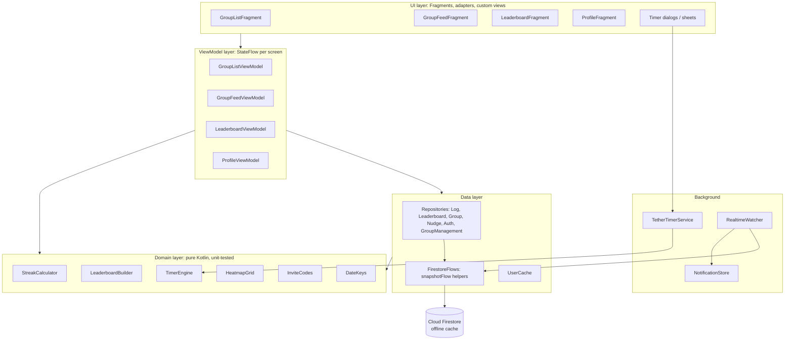
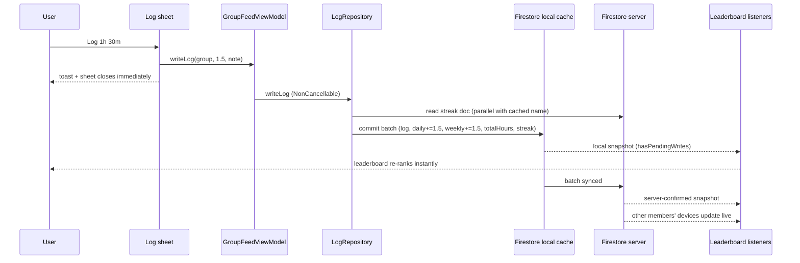

# Tether: Implementation Guide

> What has been built so far, how it works, and why it was built that way.
> Current version: **1.1.0** (versionCode 2) · Last updated: **4 Oct 2026**

---

## Contents

1. [Overview](#1-overview)
2. [Tech stack](#2-tech-stack)
3. [Architecture](#3-architecture)
4. [Data model (Firestore)](#4-data-model-firestore)
5. [Features](#5-features)
6. [Real-time data flow](#6-real-time-data-flow)
7. [Performance engineering](#7-performance-engineering)
8. [Reliability fixes](#8-reliability-fixes)
9. [Security](#9-security)
10. [Testing](#10-testing)
11. [CI/CD and releases](#11-cicd-and-releases)
12. [Local development](#12-local-development)
13. [Design decisions and trade-offs](#13-design-decisions-and-trade-offs)
14. [Known limitations](#14-known-limitations)
15. [Roadmap](#15-roadmap)
16. [Timeline](#16-timeline)
17. [Talking points](#17-talking-points)

---

## 1. Overview

Tether is a native Android social-accountability app for small friend groups (up to 6 people), aimed at Indian college students. Members log study, gym or coding hours, keep per-group streaks, compete on a leaderboard that resets every day, nudge friends who've gone quiet, and run focus sessions with a built-in timer.

| | |
|---|---|
| Platform | Android 8.0+ (minSdk 26, targetSdk 36) |
| Codebase | ~5,100 lines of Kotlin, 51 source files, 21 layouts |
| Backend | Firebase (Firestore, Auth, Crashlytics); no custom server yet |
| Tests | 42 JVM unit tests + 38 Firestore security-rule tests |
| Distribution | Sideloaded APK from GitHub Releases |

---

## 2. Tech stack

| Area | Choice |
|---|---|
| Language | Kotlin 2.2 |
| UI | XML layouts + View Binding, Material 3 (dark theme) |
| Navigation | Navigation Component, single Activity, saved/restored tab back stacks |
| Architecture | MVVM + Repository + a pure domain layer |
| Async | Coroutines, `Flow`/`StateFlow`, `callbackFlow` wrappers over Firestore listeners |
| Backend | Cloud Firestore (asia-south1), Firebase Auth (email/password + Google) |
| Background work | Foreground service (`specialUse`) for the timer; app-scoped coroutine watcher for events |
| Crash reporting | Firebase Crashlytics (release builds only; R8 mapping uploaded at build time) |
| Build | Gradle 9.3 (Kotlin DSL), AGP 9.1, R8 full shrinking, ProfileInstaller baseline profiles |
| Testing | JUnit 4; Firestore emulator + `@firebase/rules-unit-testing` + `node:test` |
| CI/CD | GitHub Actions |

---

## 3. Architecture



**Layer rules**
- **Fragments** render state and forward clicks. They collect flows inside `repeatOnLifecycle(STARTED)`, so nothing updates hidden views and listeners pause when the app is in the background.
- **ViewModels** expose `StateFlow`s built with `stateIn(viewModelScope, WhileSubscribed(5_000), …)`. Data survives navigation and configuration changes, and the 5-second grace period keeps listeners alive through quick screen switches.
- **Domain objects** contain the business rules (streaks, ranking, pace, timer phases, heatmap layout) and have no Android or Firebase dependencies, which is why they can be unit-tested.
- **Repositories** own every Firestore path. Multi-document writes always go through a `WriteBatch` or a transaction.

### Package map

```
com.tether.app
├── MainActivity            navigation host, tab handling, notification deep links
├── SplashActivity          ~1.1 s animated intro → onboarding or main
├── Onboarding*             6-slide ViewPager2 walkthrough (first launch only)
├── data/
│   ├── FirestoreFlows.kt   DocumentReference/Query → Flow (cache-first, error-tolerant)
│   ├── UserCache.kt        in-memory display name of the signed-in user
│   ├── model/              Group, Log, User (Firestore-mapped data classes)
│   └── repository/         Auth, Group, GroupManagement, Log, Leaderboard, Nudge
├── domain/                 StreakCalculator, LeaderboardBuilder, InviteCodes
├── timer/                  TimerEngine (pure), TetherTimerService, mode/control/note dialogs
├── ui/
│   ├── auth/               login, signup, Google sign-in, password reset
│   ├── group/              create / join a group
│   ├── home/               group list, group screen ("feed"), notifications sheet
│   ├── leaderboard/        leaderboard tab, shared ranked-list adapter
│   ├── log/                manual log bottom sheet
│   └── profile/            profile, HeatmapView + HeatmapGrid, About, FAQ
└── utils/                  DateKeys, Formatters, RealtimeWatcher, NotificationStore,
                            TetherToast, navigation/dialog guards
```

---

## 4. Data model (Firestore)

```
users/{uid}
  uid, name, email, groupIds[], totalHours

groups/{groupId}
  id, name, goalType, members[] (max 6), inviteCode ("" for solo),
  createdBy, solo, createdAt

logs/{logId}
  id, userId, groupId, userName, userInitials, avatarColorHex,
  date ("yyyy-MM-dd"), value (hours, 0 for system logs), note, createdAt

groupStats/{groupId}/
  daily/{yyyy-MM-dd}            { <uid>: hours }   ← incremented, never overwritten
  weekly/{yyyy-Www}             { <uid>: hours }
  streaks/{uid}                 currentStreak, longestStreak, lastLogDate
  nudges/{date}_{from}_{to}     nudgerUid, nudgerName, nudgedUid, groupId, date, timestamp
```

**Why pre-aggregated stats?** The leaderboard reads one small document per day instead of scanning raw logs: O(1) reads per screen, regardless of how many logs exist. Counters use `FieldValue.increment()`, so concurrent logs from different members never overwrite each other.

**Date keys** are always formatted with `Locale.US` (identical on every device). Week keys use the calendar *week-year*, so the last days of December don't collide with week 1 of the same year.

**Queries in use.** All of these are equality-only, so no composite index is needed:

| Query | Used by |
|---|---|
| `groups where documentId in [...]` | home list, leaderboard group picker |
| `groups where inviteCode == X limit 1` | joining |
| `users where documentId in members` | leaderboard names |
| `logs where userId == me` | profile heatmap + today's hours |
| `logs where groupId == G and date == today` | activity watcher |
| `groupStats/G/nudges where date == today` | "already nudged" state |
| `groupStats/G/nudges where nudgedUid == me and date == today` | incoming nudges |

---

## 5. Features

### 5.1 Authentication
- Email/password signup and login. Google Sign-In (`play-services-auth`), with the account picker forced on every attempt.
- "Forgot password?" sends a Firebase password-reset email to the entered address.
- The user document is created on first sign-in.
- The session persists across launches. The navigation graph's start destination is chosen at launch (`groupList` if signed in, `auth` otherwise), so signed-in users never see the auth screen flash.
- Logout signs out, clears the in-memory caches and restarts `MainActivity` with a cleared task. No stale screens or back-stack entries from the previous user remain.

*Files:* `AuthRepository`, `AuthViewModel`, `AuthFragment`, `MainActivity.setupNavController/logout`

### 5.2 Splash and onboarding
- Splash: logo bounce → wordmark → tagline, with the steps overlapped (about 1.1 s; previously about 2 s). It routes straight to onboarding on first launch, otherwise to the main screen.
- Onboarding: 6 slides (`ViewPager2` with a depth/scale transformer, animated dot indicators, pulsing "Get Started"). Completion is stored in `tether_prefs`.

### 5.3 Groups
- **Create:** name + goal (Study / Gym / Coding / Other), optionally solo. The group document and the creator's `groupIds` are written in one atomic batch. The 6-character invite code (A–Z, 0–9) is checked for uniqueness before use.
- **Join:** the invite code is normalized (case, spaces and dashes ignored), then a **transaction** re-reads the group and enforces: not already a member, not full (6), not solo. It then updates the member list and the user's `groupIds` together, so two people can't take the last spot at once.
- **Leave / delete:** both are atomic batches. Only the creator can delete. Security rules stop a user editing other members' documents, so other members' apps remove a deleted group's id from their own `groupIds` automatically, when a server snapshot shows the group no longer exists.
- **Invite code:** the ⓘ button on the group screen (hidden for solo groups) shows the code, and tapping it copies the code to the clipboard.
- **System logs:** creating or joining writes a 0-hour log ("Created the group! 🚀" / "Joined the group! 👋").

*Files:* `GroupRepository`, `GroupManagementRepository`, `GroupFragment`, `GroupListFragment`, `GroupFeedFragment`, `InviteCodes`

### 5.4 Logging hours (manual)
- Bottom sheet with hour (0–12) and minute (5-minute steps, wrapping) steppers plus an optional note. At least 5 minutes is required.
- `LogRepository.writeLog` reads the user's name (cached in memory) and current streak **in parallel**, then commits **one batch**: log document + daily stat + weekly stat + `totalHours` + streak.
- Firestore applies the batch to its local cache immediately (latency compensation), so the leaderboard updates instantly. The write runs in a `NonCancellable` context, so it completes even if the user leaves the screen straight away.
- If the streak document can't be read (offline, never cached), the log still goes through instead of failing.

### 5.5 Focus timer
**Modes:** Stopwatch (open-ended, with optional 5- or 10-minute breaks) and Pomodoro (25/5 or 50/10, cycling until stopped). Only focus time is logged.

**`TimerEngine` (pure state machine)**
- Holds an immutable `TimerState` (mode, phase, completed focus time, phase start/end timestamps on a monotonic clock).
- `advance(state, now)` walks through *every* phase boundary that has passed. A phone asleep for 2 hours in Pomodoro comes back with exactly the right phase and focus total.
- A stopwatch break that is noticed late still resumes focus at the moment the break ended.
- Break warning fires once, at 2 minutes left.
- `restoreAfterSave` shifts timestamps after a reboot (the monotonic clock restarts at 0) using the wall clock.

**`TetherTimerService` (Android shell)**
- Foreground service. Its state is persisted to SharedPreferences on every change.
- If the process is killed (common on MIUI/HyperOS), the session is restored on the next app launch, or by the system's sticky restart when that's allowed.
- The notification uses the **system chronometer**: Android ticks the clock itself, and the app re-posts the notification only on phase changes (previously every second). It is shown immediately and tapping it opens the group.
- The current session is exposed as a `StateFlow<String?>` (`activeGroupId`), which the group screen's "Start Session / Session Active ●" chip observes. There's no polling and no stale state.

**Flow:** Start Session → mode dialog → service starts → control sheet (live display, breaks, Stop) → Stop returns the focused seconds as a fragment result → note dialog → log.
- The note dialog can't be dismissed by tapping outside, since that would silently lose the session.
- Sessions under 1 minute show "too short to log". Over 24 hours shows "left running?". Neither is logged.
- A session is logged to the group it was **started in**, even if it's stopped from another group's screen.

### 5.6 Leaderboard
- **Group screen:** members ranked by today's hours, with rank colours (gold/silver/bronze plus trophy badge), streak, pace chip and today's hours.
- **Leaderboard tab:** the same list with a **Today / This Week** toggle (Today is the default), a **group picker** (tap the group name) and an empty state.
- **Real-time:** `LeaderboardRepository` combines listeners on the group document, member names (`whereIn`), today's/yesterday's/this week's stats, the streaks collection and today's nudges. `LeaderboardBuilder` turns these into ranked rows. Changes from anyone in the group appear live.
- **Midnight reset:** the flow is driven by `DateKeys.todayFlow()`, which emits again just after midnight. Listeners re-subscribe to the new day automatically, with no app restart.
- **Pace chip:** "1h 30m behind yesterday" appears only when yesterday's hours were over 30 minutes and today's are lower. It disappears once you catch up.
- **Smooth updates:** `ListAdapter` + `DiffUtil` rebind only changed rows and animate rank changes. The rank is part of each row's data, so moved rows always show the right number.

### 5.7 Streaks
- Per group: `groupStats/{gid}/streaks/{uid}`.
- `StreakCalculator.afterLog`: logged today → unchanged; logged yesterday → +1; otherwise → 1. The longest streak is kept.
- `StreakCalculator.displayed`: the stored value counts only if the last log was today or yesterday, otherwise it shows 0. The stored value only changes when someone logs, so a missed day would otherwise keep showing an old streak. The same rule is used on the leaderboard and on the profile ("best active streak").

### 5.8 Nudges
- Tap a member's avatar (group screen or leaderboard tab) to nudge them. The avatar dims once nudged, and a second tap says "Already nudged today ✓".
- Stored at `groupStats/{gid}/nudges/{date}_{from}_{to}`. The deterministic id enforces one nudge per person per day, and re-sending simply overwrites the same document.
- **Delivery:** `RealtimeWatcher` listens, per group, for nudges addressed to you today and posts a high-priority notification that opens the group. This works while the app process is alive, including in the background. Delivery to a fully closed app needs server push (see [Roadmap](#15-roadmap)).

### 5.9 Activity feed (bell)
- `RealtimeWatcher` listens to today's logs in each of your groups and records "Asha logged 1h 30m in Study Squad" and "Rahul joined Study Squad 👋" in `NotificationStore` (SharedPreferences, resets daily). Your own logs and other 0-hour system logs are ignored.
- The bell's unread dot observes a `StateFlow`. The sheet lists today's events, newest first.
- Each event is handled exactly once: a set of seen ids plus a "created after the app started" check. Exactly one watcher exists; it's reference-counted across activity instances, which matters on logout, when the new activity is created before the old one is destroyed.

### 5.10 Profile and heatmap
- Name, email, initials avatar, best active streak, today's hours and number of groups. The name is shown immediately from the auth profile, then refined from Firestore.
- A **single query** (`logs where userId == me`) drives both the heatmap and today's hours.
- **`HeatmapView`** is a custom `View` drawing the full calendar year on a `Canvas`: Monday-first columns, month labels, a 13-level green scale (one level per hour; 12h or more is brightest). It replaces a `TableLayout` of about 420 child views. The layout maths lives in the pure `HeatmapGrid`. It opens scrolled to the current week.
- About (app description and builder card with GitHub/LinkedIn links) and FAQ (8 expandable questions).

---

## 6. Real-time data flow

Logging an hour, end to end:



Snapshot listeners deliver **cached data first, then server data**, so every screen renders immediately and then corrects itself. `FirestoreFlows` turns listener errors (for example a missing permission) into `null` emissions instead of closing the flow, so one failing source can't block a whole screen.

---

## 7. Performance engineering

| Problem | Before | After |
|---|---|---|
| Leaderboard reads | Every change re-fetched the group, 2 stats docs and **3 docs per member**, sequentially from the server | A fixed set of listeners combined in memory; no re-fetching |
| Logging | 7 sequential awaited writes; the leaderboard updated only after server round trips | 1 atomic batch, applied to the local cache instantly |
| Returning to home | List hidden, then reloaded with N sequential `get()`s | ViewModel keeps the list; cache-first listener |
| Tab switches | Destinations recreated, data reloaded | Tab back stacks saved/restored with their ViewModels |
| Heatmap | ~420 views in a `TableLayout` | One `Canvas`-drawn view |
| Timer notification | Re-posted every second | System chronometer; re-posted only on phase change |
| Lists | `notifyDataSetChanged()` / new adapter per update | `ListAdapter` + `DiffUtil` |
| Toasts | Queued behind each other | The new one replaces the old one |
| Startup | ~2 s splash + extra activity hop | ~1.1 s splash, direct routing, no auth flash |
| APK / runtime | Debug-style build, no shrinking | R8 + resource shrinking (14.8 MB → 6.7 MB), baseline profiles via ProfileInstaller |
| Overdraw | Window + root both painted the background | Window background removed in `MainActivity` |
| Activity listeners | A new set added on every home visit, never removed | One app-scoped watcher, restarted only when groups or day change |

---

## 8. Reliability fixes

**Data and logic**
- Nudge notifications were never delivered: a `collectionGroup("nudges")` query couldn't match the old path, and the listener didn't start if you logged in during that launch. Nudges were redesigned (see 5.8).
- Group deletion with more than one member failed halfway (rules block editing other users' documents). It's now one batch, with lazy cleanup by the other members' apps.
- The 6-member cap could be exceeded by simultaneous joins. Joining is now a transaction, also enforced in the security rules.
- Joining a group posted a "logged 0m" activity notification. Joins now read "X joined G".
- The profile streak ignored broken streaks. It now uses the shared `StreakCalculator.displayed` rule.
- Week keys would have merged late-December hours into January's week 1. The key now uses the week-year.
- Date keys depended on the device locale. They're now fixed to `Locale.US`.
- Invite codes typed with dashes (as the input hint shows) didn't match. They're now normalized.

**Timer**
- Time was counted by ticks. It's now computed from timestamps, so it's exact through sleep and delayed ticks.
- A killed process lost the session, and a sticky restart created a phantom empty session. State is now persisted and restored; empty restarts stop themselves.
- Tapping outside the note dialog dropped the session.
- A session stopped from another group's screen was never logged.
- Cancelling the mode dialog left the chip stuck on "Session Active".
- Very short sessions logged "0m". Sessions over 24 hours could be logged.

**UI and navigation**
- Back after logout returned to the signed-out user's profile. Logout now restarts the activity with a cleared task.
- The bottom-nav highlight drifted after pressing back. It's synced in the destination listener, without retriggering navigation.
- Double-taps crashed navigation ("destination unknown") or opened duplicate dialogs. Added `navigateSafe` and `showOnce` guards.
- The group menu could offer "Leave" to the creator before the group had loaded.
- Error toasts re-appeared when screens were recreated. Errors are now one-shot events (`Channel`), consumed after display.
- "Forgot password?" did nothing.
- Onboarding fragments were pre-instantiated, which can crash on restore. They're now created on demand.

---

## 9. Security

[`firestore.rules`](../firestore.rules) is written to mirror every access path in the app:

| Data | Read | Write |
|---|---|---|
| `users/{uid}` | any signed-in user (names) | owner only; restricted field set |
| `groups/{id}` | any signed-in user (invite lookup) | create as sole member and creator; update only by adding/removing **yourself** (join ≤ 6, not solo); delete by creator |
| `logs/{id}` | signed-in users | create as yourself, in a group you belong to, 0–24 hours; delete your own; no edits |
| `groupStats/{g}/daily`, `weekly` | signed-in users | members only; only **your own** counter; can only **increase** by ≤ 24 per write |
| `groupStats/{g}/streaks/{uid}` | signed-in users | members, own document, fixed keys |
| `groupStats/{g}/nudges/{id}` | signed-in users | members; must be from you, to another member; id must equal `date_from_to` |
| legacy `nudges/**` | signed-in users | signed-in users (old app versions only; remove later) |
| anything else | denied | denied |

Rules are tested against the emulator: 38 cases replaying the app's real batches and transactions plus abuse cases (other people's hours, kicking members, joining full or solo groups, 30-hour logs, spoofed nudges, …). The rules have to be deployed manually (`firebase deploy --only firestore:rules`) after the tests pass.

---

## 10. Testing

**Unit tests** (`app/src/test`, JVM, run in seconds)

| Suite | Tests | Covers |
|---|---|---|
| `StreakCalculatorTest` | 9 | first log, same day, consecutive, gaps, longest record, month/year/leap boundaries, display rule |
| `LeaderboardBuilderTest` | 9 | ranking, stable ties, missing data, unknown users, broken streaks, nudge flags, pace labels |
| `TimerEngineTest` | 10 | stopwatch timing, late break resume, break permissions, Pomodoro boundaries and multi-cycle catch-up, focus-only counting, break warning, reboot recovery |
| `HeatmapGridTest` | 5 | intensity levels, Monday-first grid size, cell placement, month labels, today marker |
| `DateKeysAndFormattersTest` | 7 | previous day across boundaries, week-year keys, ASCII date keys, hour formatting, initials, avatar colours |
| `InviteCodesTest` | 2 | normalization, generation format |

**Rules tests** (`firestore-tests/rules.test.js`): 38 tests across users, groups, logging, reading, nudges and default-deny.

```bash
./gradlew testDebugUnitTest                       # unit tests
cd firestore-tests && npm install && npm test     # rules (needs Java 11+)
```

---

## 11. CI/CD and releases

`.github/workflows/ci.yml` has three jobs:

1. **android:** `testDebugUnitTest`, `lintDebug`, `assembleDebug`. Test and lint reports are uploaded as artifacts. Builds use the real `google-services.json` from secrets, or a placeholder for forks and PRs.
2. **firestore-rules:** Node 22 + Java 21, `npm ci`, emulator rules tests.
3. **release** (only on `v*` tags, after both jobs pass): builds a signed, R8-optimized APK and attaches it to a GitHub Release as `Tether.apk`. The README's download badge points at that file.

**Repository secrets for releases**

| Secret | Value |
|---|---|
| `GOOGLE_SERVICES_JSON` | contents of `app/google-services.json` |
| `TETHER_KEYSTORE_BASE64` | `base64` of the signing keystore (currently the debug keystore whose SHA-1 is registered in Firebase) |
| `TETHER_KEYSTORE_PASSWORD` | `android` for a debug keystore |
| `TETHER_KEY_ALIAS` | `androiddebugkey` for a debug keystore |
| `TETHER_KEY_PASSWORD` | `android` for a debug keystore |

**Cutting a release:** bump `versionCode`/`versionName` in `app/build.gradle.kts`, commit, then `git tag v1.1.0 && git push origin v1.1.0`.

Crashlytics is enabled only in release builds (manifest placeholder). The plugin uploads the R8 mapping file during `assembleRelease`, so crash stack traces are readable.

---

## 12. Local development

| Requirement | Notes |
|---|---|
| JDK 21 | Kotlin 2.2.10 isn't reliable on JDK 25 |
| Android SDK | platform 36, build-tools 36 (`local.properties` → `sdk.dir`) |
| `app/google-services.json` | from the Firebase console (gitignored) |
| Node 22 + Java | only for the rules tests |

```bash
./gradlew assembleDebug          # debug APK
./gradlew assembleRelease        # optimized APK (debug-signed locally)
./gradlew testDebugUnitTest lintDebug
```

Google Sign-In requires the SHA-1 of the signing key to be registered in Firebase. Two keys are currently registered: the original development key and the current build machine's key.

---

## 13. Design decisions and trade-offs

| Decision | Why | Trade-off |
|---|---|---|
| Pre-aggregated `groupStats` counters | O(1) leaderboard reads, safe concurrent increments | Clients write the aggregates, so their integrity relies on security rules (see Roadmap: server-side aggregation) |
| Snapshot listeners everywhere (cache-first) | Instant UI, live multi-user updates, offline support | More open listeners; mitigated by `WhileSubscribed` and lifecycle-aware collection |
| Atomic batches/transactions for multi-doc writes | No half-applied state (e.g. stats without a log) | A batch needs the streak read first (one round trip, in parallel with the name lookup) |
| Timer as pure engine + thin service | Exact, testable time-keeping; easy to reason about | Persistence and restore code to maintain |
| Nudges under `groupStats/{g}/nudges` | Covered by group-scoped rules; no collection-group rule or composite index; deterministic id = rate limit | Recipients need one listener per group (fine at ≤ a handful of groups) |
| Local notifications instead of FCM | Works on the free Spark plan, no server | No delivery when the app process is dead |
| Manual dependency wiring (constructor defaults), no Hilt yet | Keeps the AGP 9 build simple and fast | Less formal DI; Hilt is on the roadmap |
| Custom `Canvas` heatmap | One view instead of ~420; smooth scrolling | Custom drawing code (tested via `HeatmapGrid`) |
| Release signed with the registered debug key | Google Sign-In keeps working for sideloaded installs without new Firebase setup | Must switch to a dedicated upload key before publishing on Play |
| Logs readable by any signed-in user | The profile heatmap must include logs from groups you've left | Notes are visible to signed-in users who know a group id |

---

## 14. Known limitations

- **Nudges and activity events** only arrive while the app process is alive. True push to a closed app needs Cloud Functions + FCM (Blaze plan).
- **Leaderboard integrity** is enforced by rules (own counter, increase-only, ≤ 24h per write), but a determined user could still log fake manual hours. Verified sessions are planned.
- **Email addresses** are readable by signed-in users (they live on the user document). They could move to a private subcollection.
- **No log editing yet:** a mistaken log can be deleted only by direct Firestore access. The rules already allow deleting your own log.
- **Portrait only; dark theme only.**
- **Deleted groups** leave their `logs`/`groupStats` behind, deliberately, so the members' history and heatmaps stay intact.

---

## 15. Roadmap

Planned "lovable product" features, chosen for both student appeal and engineering depth:

1. **Study Together:** live presence ("🟢 Rahul, 1h 12m into DSA") and one-tap shared sessions. Realtime Database presence with `onDisconnect`, heartbeats, stale-session cleanup.
2. **Verified Focus:** timer sessions get a ✓ and a focus score (phone pickups, time in other apps); verified and manual hours are shown separately. Ideally the server computes the aggregates from raw sessions (Cloud Functions), which closes the integrity gap above.
3. **Tether Wrapped:** weekly/semester recap card with personas (Night Owl, Weekend Warrior), week-over-week growth and a Perfect Week badge, shareable to stories. A scheduled job pre-computes summaries (O(1) reads per user).
4. **Quality of life:** edit/delete a log, daily streak reminder, streak freeze, home-screen widget, in-app update prompt.
5. **Engineering:** Hilt DI, a Firebase BoM 34 upgrade, a dedicated release keystore, Play Store listing.

---

## 16. Timeline

| Date | Milestone |
|---|---|
| 28 Apr 2026 | MVP screens (auth, feed, log sheet, leaderboard, groups, profile) on dummy data; Firebase project set up |
| 2 May 2026 | Firestore integration: real logging, leaderboard, group management, streaks, heatmap, focus timer |
| 3 May 2026 | Pace indicator, hours + minutes logging, notification deep link to group, feed index |
| 4–6 May 2026 | Per-group streaks, 6-member cap, nudges, Google Sign-In, logo, splash, onboarding, About/FAQ, activity bell; ~24 bug fixes |
| 11 May 2026 | Leaderboard streak staleness fix |
| 4 Oct 2026 | **v1.1.0:** performance and reliability overhaul (sections 7–8), nudge redesign, timer engine, leaderboard group picker, password reset, R8 release build |
| 4 Oct 2026 | Engineering foundation: domain layer + 42 unit tests, security rules + 38 emulator tests, Crashlytics, GitHub Actions CI/CD, this document |

---

## 17. Talking points

- **Real-time systems:** "The leaderboard is a reactive pipeline: seven Firestore listeners combined with Kotlin Flow, re-subscribing automatically at midnight. Replacing per-member server fetches with combined listeners removed an N+1 read pattern."
- **Consistency:** "All multi-document writes are atomic batches or transactions. Joining a group is a transaction, so the 6-member cap holds under concurrent joins, and it's also enforced in security rules."
- **Correct time-keeping:** "The timer is a pure state machine over monotonic timestamps. It's exact through device sleep, catches up across multiple Pomodoro cycles, survives process death through persisted state, and handles reboots by re-basing the clock. All of it is unit-tested."
- **Security:** "The security rules mirror the app's access paths: users can only increase their own counters by at most 24 hours per write, and only in groups they belong to. Emulator tests replay the app's real batches plus abuse cases."
- **Performance:** "I profiled the slowness down to sequential server round trips and view-heavy rendering, moved to cache-first listeners, atomic local-first writes, DiffUtil and a Canvas-drawn heatmap, and enabled R8 plus baseline profiles. The APK shrank from 14.8 to 6.7 MB."
- **Engineering hygiene:** "Business rules sit in a framework-free domain layer with unit tests; CI runs tests, lint and rules tests on every push and ships a signed APK on tags; Crashlytics with uploaded R8 mappings gives readable production crashes."
